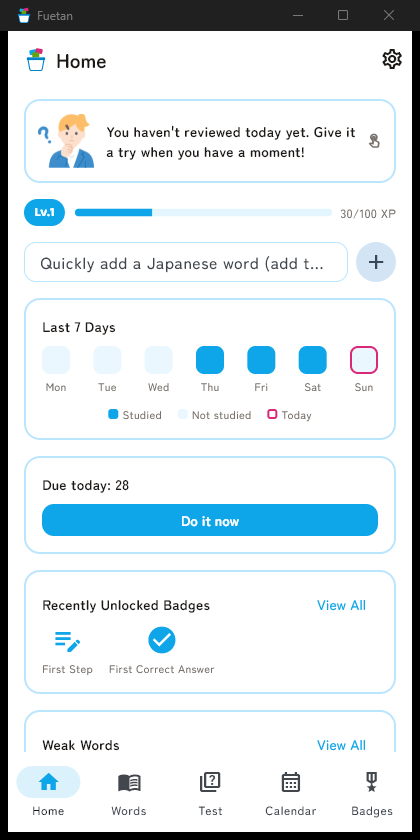

# ふえたん / Fuetan

[日本語](README.md) | [English](README.en.md)

[](https://github.com/Dokya0513/Huetan/actions/workflows/ci.yml)

A vocabulary learning app (Windows desktop / Android) for quickly jotting down words you didn't know and reviewing them with flashcards. Supports both a mode for Japanese speakers learning English words and a mode for English speakers learning Japanese words.




## Before You Use This (Disclaimer & About Development)

This app is developed by an individual as a hobby project, with no guarantee of functionality or support. **The developer is not responsible for any damages arising from use (data loss, PC malfunction, etc.).** Please download and use it only at your own risk and discretion.

**This app's code was developed using Anthropic's Claude (an AI coding assistant).** Please download and use it only if you understand and accept this.

## Installation (for non-technical users)

### Windows

1. Open the [Releases page](https://github.com/Dokya0513/Huetan/releases/latest)
2. Click `fuetan-windows-vX.X.X.zip` to download it
3. Right-click the downloaded zip file → "Extract All", and extract it somewhere convenient (e.g. your Desktop)
4. Double-click `english_learning.exe` inside the extracted folder to launch the app

   > On first launch, you may see a blue "Windows protected your PC" screen. This is a standard Windows warning shown for personal apps without a distribution certificate — it isn't dangerous.
   > Click **"More info"**, then click the **"Run anyway"** button that appears to launch the app.

5. From then on, right-click `english_learning.exe` → "Send to" → "Desktop (create shortcut)" for a convenient desktop icon

**Notes**

- Extract the whole folder. Moving only `english_learning.exe` elsewhere will break it
- Your registered words and other data are stored locally on this PC (in your Documents folder). To carry your data over to another PC, use Settings → "Data" in the app to export a file, then "Import" it on the other PC
- No development tools like Flutter need to be installed — the steps above are all you need

### Android

1. Open the [Releases page](https://github.com/Dokya0513/Huetan/releases/latest)
2. Tap `fuetan-android-vX.X.X.apk` to download it
3. Tap the downloaded apk file to install it

   > You may see a confirmation screen asking whether to allow "install unknown apps". This is a standard Android warning for apps distributed outside a store (like Google Play) — it isn't dangerous. Follow the prompts to allow installation from this app.

**Notes**

- Your registered words and other data are stored locally on your device. To carry your data over to another device or PC, use Settings → "Data" in the app to export a file, then "Import" it on the other device

## License & Usage

This app is a private, individually-developed project. **Redistribution of the app itself (the exe file/zip) and the source code is prohibited.** If this was shared with you, please keep your use to yourself.

### Credits

- English word level classification uses the [CEFR-J Wordlist Version 1.6](http://www.cefr-j.org/download.html) (Tokyo University of Foreign Studies, Tono Laboratory)
- Japanese word level classification uses [jlpt-word-list](https://github.com/elzup/jlpt-word-list) (MIT; original data: Jonathan Waller's JLPT Resources / tanos.co.uk, CC BY)
- Japanese dictionary auto-fill uses JMdict/EDICT (Electronic Dictionary Research and Development Group, CC BY-SA 4.0) via [jmdict-simplified](https://github.com/scriptin/jmdict-simplified)
- English dictionary auto-fill, example sentences, and pronunciation use [dictionaryapi.dev](https://dictionaryapi.dev/) (sourced from [Wiktionary](https://en.wiktionary.org/), CC BY-SA 3.0/4.0)
- Character illustrations are from [Sokosuto](https://soco-st.com/) (redistribution of the illustration assets themselves is prohibited)
- Fonts: [Baloo 2](https://fonts.google.com/specimen/Baloo+2) / [Zen Maru Gothic](https://fonts.google.com/specimen/Zen+Maru+Gothic) (both SIL Open Font License)

## Key Features

- **Two learning modes**: Learn English (for Japanese speakers, Japanese UI) / Learn Japanese (for English speakers, English UI) — switch anytime from Settings. The UI language automatically follows whichever mode is selected
- Add/edit words (word / meaning / example sentence / part of speech / pronunciation), with search and sorting in the word list
- Quick add (register just the target word, with meaning/part of speech auto-filled in the background)
- Three review formats
  - Flashcards (Leitner System weighting so weaker words appear more often; flip and self-grade)
  - 4-choice quiz (shown the word or its meaning, auto-graded)
  - Fill-in-the-blank quiz (blanks out the word in an example sentence, 4-choice auto-graded)
- Review sessions filtered by part of speech / level (handy for focused pre-exam study)
- SRS-based review scheduling (the interval before the next review grows the more you get a word right)
- Automatic dictionary lookup (English-learning mode: dictionary API; Japanese-learning mode: JMdict) for part of speech, example sentences, meaning, and pronunciation — pick from multiple senses when a word has more than one
- Pronunciation playback (cached dictionary audio, or on-device TTS; for Japanese, the dictionary's reading is preferred over raw kanji to avoid mispronunciation)
- Word level classification and breakdown via CEFR-J (English) / JLPT (Japanese)
- Breakdown by part of speech
- Study calendar (activity heatmap, and a 7-day graph of "words added" / "words reviewed")
- Gamification: XP & levels, badges, and streaks
- Mascot character comments tailored to your situation (study progress, part-of-speech balance, streak length)
- Data export/import (backup, or moving data to another PC)
- Dark mode support

## For Developers

### Tech Stack

- [Flutter](https://flutter.dev/) / Dart
- [Drift](https://drift.simonbinder.eu/) (SQLite-based local DB)
- [flutter_riverpod](https://riverpod.dev/) (state management)

### Setup

```bash
flutter pub get
flutter pub run build_runner build
```

### Run

```bash
flutter run -d windows
# or
flutter run -d <Android device/emulator ID>
```

Building the Windows version requires Visual Studio (with the "Desktop development with C++" workload) and `nuget.exe` (used to build `flutter_tts`).
Building the Android version requires the Android SDK.
